# Agentic AI Healthcare Patient Management System
## Technical Architecture Plan

**Document Type:** Technical Architecture & System Design Specification
**Audience:** Graduation Project Supervisors · Hackathon Judges · Healthcare Stakeholders · Engineering Teams
**Version:** 1.0

---

## Table of Contents

1. [Problem Analysis](#1-problem-analysis)
2. [Simple Architecture (High-Level)](#2-simple-architecture-high-level)
3. [How the System Works (Step-by-Step)](#3-how-the-system-works-step-by-step)
4. [Technical Architecture — Agent Deep Dives](#4-technical-architecture-each-agent-in-detail)
5. [Agent Communication Architecture](#5-agent-communication-architecture)
6. [Knowledge Base Design](#6-knowledge-base-design)
7. [RAG Architecture](#7-rag-architecture)
8. [Vector Database Design](#8-vector-database-design)
9. [AI Framework & Technology Stack](#9-ai-framework--technology-stack)
10. [Memory Architecture](#10-memory-architecture)
11. [Security & Compliance](#11-security--compliance)
12. [Comparison Table — All Agents at a Glance](#12-comparison-table--all-agents-at-a-glance)
13. [Full Project Structure](#13-full-project-structure)
14. [MVP vs Enterprise Version](#14-mvp-vs-enterprise-version)
15. [Final System Diagrams](#15-final-system-diagrams)

---

## 1. Problem Analysis

### 1.1 Business Problems

Healthcare delivery — particularly in mid-to-large hospitals and multi-branch clinic networks — suffers from systemic inefficiencies that directly harm patient outcomes and operational margins. This system targets the following exact problems:

| # | Problem | Real-World Impact |
|---|---------|-------------------|
| 1 | Long, unpredictable wait times | Patient dissatisfaction, walkouts, reduced trust |
| 2 | Manual, phone-based appointment booking | Call center overload, double-booking, no-shows |
| 3 | No intelligent emergency triage at first contact | Critical cases delayed behind routine bookings |
| 4 | Medical records scattered across systems/branches | Doctors re-diagnose, repeat tests, miss history |
| 5 | One-way, transactional patient communication | Low retention, missed follow-ups, poor loyalty |
| 6 | No visibility into bottlenecks (rooms, doctors, queues) | Hospital management flies blind on capacity |
| 7 | Underused analytics on patient flow & outcomes | Missed opportunities for resource optimization |

### 1.2 Stakeholders

- **Patients** — need fast, simple access to care and clear communication.
- **Doctors / Clinicians** — need complete history, less admin work, AI-assisted notes.
- **Nurses / Front-desk staff** — need automated intake and reduced manual data entry.
- **Hospital Administrators** — need real-time operational visibility and KPI dashboards.
- **Call Center Agents** — need fewer repetitive calls, AI handling routine requests.
- **Insurance / Billing Teams** — need structured, accurate, auditable records.
- **IT & Compliance Officers** — need a secure, HIPAA/GDPR-aligned system.

### 1.3 Current Pain Points (As-Is State)

- Patients call or walk in with no pre-visit triage — front desk staff make ad hoc urgency judgments.
- Appointment slots are manually managed in spreadsheets or legacy hospital information systems (HIS) with no predictive logic.
- Medical history is siloed per branch/department; a patient seen in Cardiology and later in the ER may not have a unified chart.
- There is no proactive notification system — patients forget appointments, miss follow-ups, or don't receive lab results.
- There's no loyalty/retention mechanism, so patients churn to competing providers.
- Hospital leadership has no consolidated dashboard correlating wait times, doctor utilization, and patient satisfaction.

### 1.4 Technical Problems

- **Data silos** — Patient data, scheduling data, and clinical notes live in separate, often incompatible systems (legacy HIS, Excel, paper).
- **Scheduling inefficiencies** — Static, rule-free slot allocation; no demand forecasting; no dynamic re-balancing when doctors run late.
- **Poor patient prioritization** — No structured triage logic; symptom severity isn't scored or queued intelligently.
- **Communication delays** — Notifications (if any) are manual SMS blasts with no personalization or timing intelligence.
- **Lack of intelligent automation** — Nearly every workflow (intake forms, scheduling, follow-ups, escalation) requires a human to manually drive it end-to-end.

### 1.5 Key Performance Indicators (KPIs)

| KPI | Definition | Target Improvement |
|-----|------------|---------------------|
| Appointment booking time | Time from patient request to confirmed slot | Reduce from ~8 min (call) to <60 sec (agentic) |
| Average waiting time | Time from check-in to being seen | Reduce by 30–40% via queue prediction |
| Emergency response time | Time from symptom report to triage escalation | <2 minutes for high-risk cases |
| Patient satisfaction score (CSAT/NPS) | Post-visit survey score | Increase by 20%+ |
| Doctor utilization rate | % of scheduled doctor time actively used | Increase to 85–90% |
| Call center workload reduction | % of inquiries resolved without human agent | 60–70% deflection rate |
| No-show rate | % of booked appointments missed | Reduce via smart reminders |
| Record completeness | % of patient visits with fully linked history | Near 100% via unified Medical History Agent |

---

## 2. Simple Architecture (High-Level)

This is the beginner-friendly mental model: every patient interaction, regardless of channel, flows through a single **Orchestrator Agent**, which routes work to specialized agents, which in turn read/write to shared databases and ultimately produce an outcome for the patient and hospital staff.

```
Patient
  │
  ▼
[Channels: Mobile App | Website | Voice Assistant | WhatsApp | Call Center]
  │
  ▼
[Orchestrator Agent]  ◄──────────────► [Shared Context / Memory Layer]
  │
  ├──► Patient Intake Agent
  ├──► Triage Agent
  ├──► Medical History Agent
  ├──► Scheduling Agent
  ├──► Queue Prediction Agent
  ├──► Notification Agent
  ├──► Loyalty Agent
  ├──► Doctor Assistant Agent
  └──► Analytics & Optimization Agent
       │
       ▼
[Databases: Patient DB | EHR | Scheduling DB | Vector DB | Analytics Warehouse]
       │
       ▼
[Hospital Staff: Doctors | Nurses | Admins | Call Center]
```

### 2.1 Channels Layer

| Channel | Purpose |
|---------|---------|
| **Mobile App** | Primary self-service channel — booking, reminders, chat with AI assistant |
| **Website** | Web-based booking and patient portal |
| **Voice Assistant** | IVR/voice bot for phone-based patients, especially elderly demographics |
| **WhatsApp** | High-adoption messaging channel for reminders, rebooking, quick Q&A |
| **Call Center** | Human agents assisted by AI (agent-assist copilot), used as fallback/escalation |

### 2.2 Step-by-Step Workflow (Patient Request → Outcome)

1. **Entry**: Patient initiates contact via any channel (e.g., "I need to see a doctor, I have chest pain").
2. **Normalization**: The channel adapter converts the input (text, voice transcript, button taps) into a standard internal message format.
3. **Orchestration**: The Orchestrator Agent receives the message, classifies intent (registration, booking, emergency, follow-up, general question), and determines which specialized agent(s) to invoke.
4. **Specialized Processing**: One or more agents execute in sequence or parallel (e.g., Triage Agent assesses urgency → Scheduling Agent finds a slot → Notification Agent confirms).
5. **Data Persistence**: Agents read/write to the appropriate databases (Patient DB, EHR, Scheduling DB) and the Vector DB for knowledge retrieval.
6. **Human Handoff (if needed)**: For emergencies or ambiguous cases, the Orchestrator escalates to human staff with full context attached.
7. **Outcome Delivery**: The patient receives a confirmation, recommendation, or escalation message back through their original channel.
8. **Feedback Loop**: The Analytics & Optimization Agent logs the interaction for KPI tracking and continuous system improvement.

---
## 3. How the System Works (Step-by-Step)

### Scenario 1: New Patient Registration

**Context:** A first-time patient downloads the app and wants to book a general consultation.

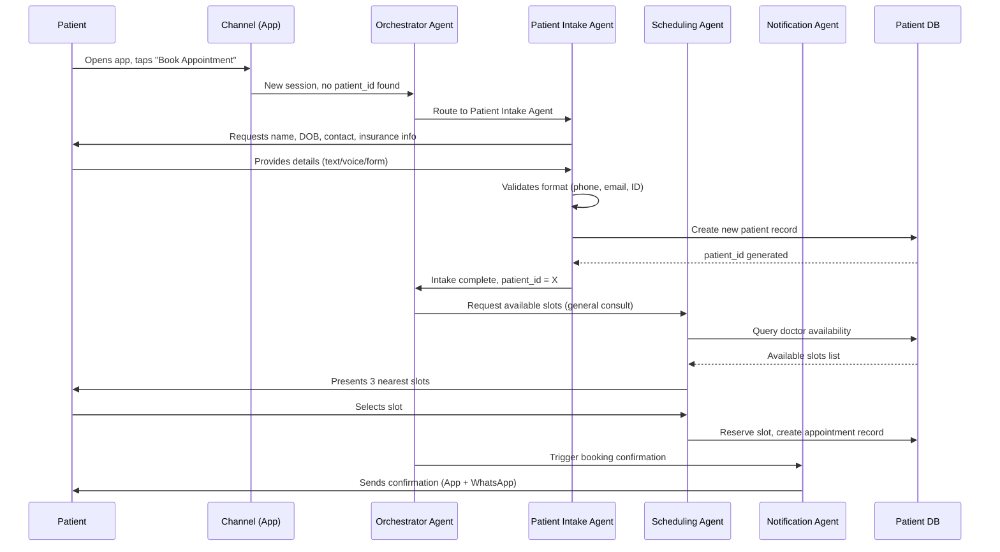

**Steps explained:**
1. **Patient interaction** — Patient opens the mobile app and initiates a booking request; no existing profile is found.
2. **Data collection** — Patient Intake Agent conversationally collects demographic and insurance details, validating each field in real time (e.g., phone format, duplicate-record check).
3. **Record creation** — A new patient record is created in the Patient DB with a unique `patient_id`; this becomes the anchor for all future interactions.
4. **Appointment booking** — Scheduling Agent queries doctor availability filtered by specialty/location and proposes optimal slots.
5. **Notifications** — Notification Agent sends a confirmation across the patient's preferred channels, with a calendar invite and pre-visit instructions.

---

### Scenario 2: Returning Patient

**Context:** An existing patient messages via WhatsApp: "I need to see Dr. Sarah again about my blood pressure."

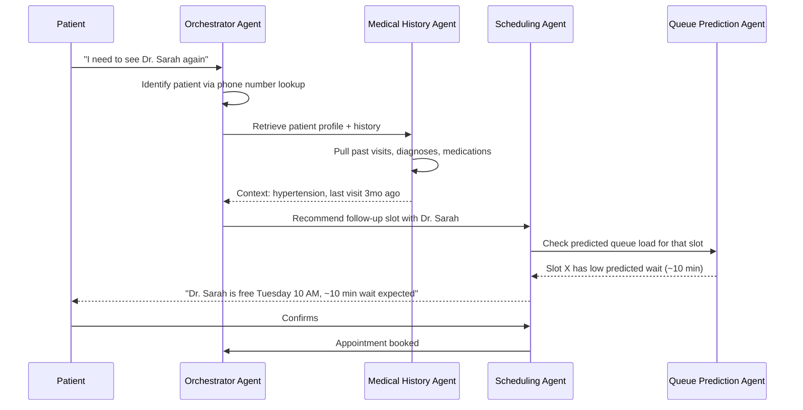

**Steps explained:**
1. **Profile retrieval** — Orchestrator identifies the returning patient via channel identifier (phone number, app login) and loads their `patient_id`.
2. **Medical history retrieval** — Medical History Agent pulls relevant clinical context (condition, last visit, medications) to personalize the interaction without the patient repeating themselves.
3. **Appointment recommendation** — Scheduling Agent proposes the most relevant doctor/slot combination, factoring in continuity of care (same doctor when possible).
4. **Queue management** — Queue Prediction Agent estimates wait time for candidate slots so the patient can choose based on convenience, not just availability.

---

### Scenario 3: Emergency Case

**Context:** A patient messages: "My father is having severe chest pain and can't breathe well."

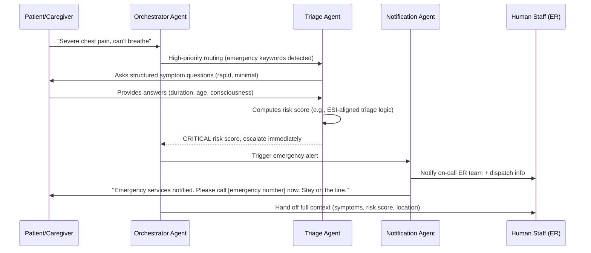

**Steps explained:**
1. **Symptom collection** — Triage Agent asks the minimum number of high-signal questions needed (onset, severity, red-flag symptoms) — optimized for speed, not depth.
2. **Triage process** — Responses are scored using a structured clinical triage framework (e.g., an Emergency Severity Index–inspired model) rather than free-form LLM judgment alone.
3. **Risk scoring** — A deterministic scoring layer (rules + ML classifier) produces a risk tier (Critical / Urgent / Standard) — the LLM assists in extracting structured symptoms, but the final score uses auditable logic, not a black-box generation.
4. **Emergency escalation** — On a Critical score, the system bypasses normal queuing entirely, alerts human ER staff with full context, and instructs the patient to contact local emergency services directly — the AI **never delays** a critical patient by attempting to "handle" the emergency itself.

> ⚠️ **Safety Design Principle:** The Triage Agent is explicitly designed to *escalate fast and over-trigger* on ambiguous emergency signals. False positives (unnecessary escalations) are an acceptable tradeoff; false negatives (missed emergencies) are not.

---

### Scenario 4: Doctor Consultation

**Context:** A doctor is in a live consultation with a patient and uses the AI-assisted workstation.

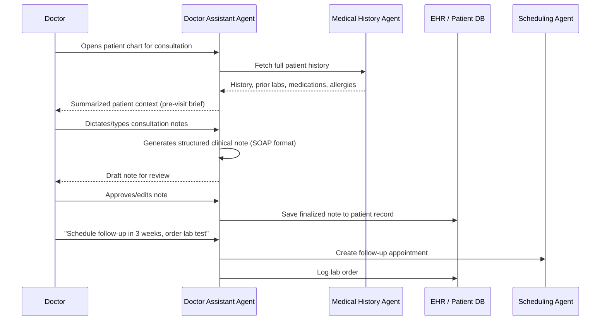

**Steps explained:**
1. **Doctor Assistant Agent workflow** — Before the visit, the agent prepares a concise pre-visit brief (chronic conditions, recent visits, flagged allergies) so the doctor doesn't need to dig through raw records.
2. **Medical note generation** — During/after the consultation, the agent converts dictated or typed notes into a structured clinical format (e.g., SOAP: Subjective, Objective, Assessment, Plan), always presented as a **draft requiring doctor approval**.
3. **Record updates** — Once approved, the note is written to the EHR, maintaining a clear human-in-the-loop checkpoint for all clinical documentation.
4. **Follow-up scheduling** — Any follow-up actions (next appointment, lab orders, prescriptions) are delegated to the Scheduling Agent and logged, closing the loop without manual admin work.

---
## 4. Technical Architecture (Each Agent in Detail)

Each agent below is specified with its purpose, inputs, processing logic, tools, outputs, connected databases, and a representative system prompt.

---

### 4.1 Orchestrator Agent

**Purpose:** Acts as the central router and conversation manager. It owns the overall session state, classifies patient intent, decides which specialized agent(s) to invoke, sequences multi-agent workflows, and manages human-in-the-loop escalation.

**Inputs:**
- Raw patient message (text/voice transcript) + channel metadata
- Session/conversation history
- Patient identity (if resolved)
- Agent responses (for sequencing follow-up actions)

**Processing Logic:**
- Intent classification (registration / booking / emergency / follow-up / inquiry / complaint)
- Patient identity resolution (lookup by phone/app ID, or flag as new patient)
- Routing decision: which agent(s) to call, in what order (sequential or parallel)
- Conflict resolution when multiple agents return competing recommendations
- Escalation trigger detection (emergency keywords, repeated failures, explicit human request)

**Tools Used:**
- LLM (intent classification, dialogue management)
- Rules engine (deterministic routing for safety-critical paths like emergencies)
- Shared memory/context store

**Outputs:**
- Routed task to one or more specialized agents
- Aggregated, unified response back to the patient
- Escalation events to human staff

**Connected Databases:**
- Session/Context Store (Redis)
- Patient DB (for identity resolution)
- Audit Log DB

**Example Prompt:**
```
You are the Orchestrator Agent for a hospital patient management system.
Your job is to classify the patient's intent and route to the correct
specialized agent. You do NOT answer clinical questions yourself.

Available agents: patient_intake, triage, medical_history, scheduling,
queue_prediction, notification, loyalty, doctor_assistant, analytics.

Rules:
- If the message contains ANY emergency indicators (severe pain, difficulty
  breathing, loss of consciousness, severe bleeding, suicidal ideation),
  immediately route to `triage` with priority=CRITICAL. Do not ask
  clarifying questions first.
- If the patient is unrecognized, route to `patient_intake` first.
- If the request involves booking/rescheduling, route to `scheduling`
  after confirming patient identity via `medical_history` lookup.
- Always explain your routing decision in a structured JSON object:
  {"intent": "...", "route_to": ["..."], "priority": "...", "reasoning": "..."}

Conversation history: {conversation_history}
Patient message: {patient_message}
```

---

### 4.2 Patient Intake Agent

**Purpose:** Handles structured data collection for new patients and updates to existing patient demographic/insurance information. Converts unstructured conversational input into validated structured records.

**Inputs:** Conversational patient responses (name, DOB, contact info, insurance details, emergency contact)

**Processing Logic:**
- Conversational form-filling (asks one/few questions at a time, not a wall of fields)
- Field-level validation (phone format, email format, ID number checksum, age plausibility)
- Duplicate-record detection (fuzzy match on name + DOB + phone)
- Consent capture (data processing consent, HIPAA acknowledgment)

**Tools Used:**
- LLM (conversational extraction, entity recognition)
- Validation/regex utilities
- Duplicate-detection ML model (fuzzy matching)

**Outputs:** Structured patient profile object; `patient_id`; consent record

**Connected Databases:** Patient DB (write), Consent/Audit Log

**Example Prompt:**
```
You are the Patient Intake Agent. Collect the following fields one or two
at a time, in natural conversational language: full name, date of birth,
phone number, email, national ID/insurance number, emergency contact.

Validate each input before moving to the next field. If a field is
invalid or ambiguous, politely ask the patient to confirm or re-enter it.
Never proceed to scheduling until all required fields pass validation
and consent has been explicitly given.

Output a structured JSON object after each turn:
{"field": "...", "value": "...", "valid": true/false, "next_question": "..."}
```

---

### 4.3 Triage Agent

**Purpose:** Assesses symptom severity and urgency to ensure patients are prioritized appropriately — the single most safety-critical agent in the system.

**Inputs:** Reported symptoms, patient age/known conditions (if available), duration/onset of symptoms

**Processing Logic:**
- Structured symptom extraction from free text/voice
- Risk scoring using a deterministic, clinically-aligned framework (e.g., ESI-inspired 5-level triage) layered on top of LLM-assisted extraction — the **scoring logic itself is rules/ML-based, not purely generative**, for auditability and safety
- Red-flag keyword detection (chest pain, stroke symptoms, severe bleeding, breathing difficulty, suicidal ideation) that triggers immediate escalation regardless of other scoring
- Confidence thresholding: low-confidence assessments are escalated to human review rather than resolved automatically

**Tools Used:**
- LLM (symptom extraction/structuring)
- Clinical rules engine (deterministic triage scoring)
- Classification ML model (trained on historical triage outcomes, where available)

**Outputs:** Risk tier (Critical / Urgent / Standard / Non-urgent), structured symptom summary, escalation flag

**Connected Databases:** Medical History DB (read, for known conditions/allergies), Clinical Protocols Knowledge Base (RAG), Audit Log

**Example Prompt:**
```
You are the Triage Agent. Your ONLY job is to extract symptoms and
support a clinical risk score — you do NOT diagnose or provide treatment
advice. Ask the minimum number of high-signal questions needed.

If the patient reports any of: chest pain, difficulty breathing, loss of
consciousness, severe bleeding, stroke symptoms (face drooping, arm
weakness, speech difficulty), or suicidal ideation — immediately output
priority=CRITICAL and stop asking further questions. Instruct the
patient to contact emergency services directly.

Output format:
{"symptoms": [...], "onset": "...", "severity_self_report": "...",
 "red_flags_detected": [...], "recommended_priority": "CRITICAL|URGENT|STANDARD"}

This output feeds a deterministic scoring layer — do not assign the
final clinical priority yourself; flag red flags clearly and let the
rules engine confirm.
```

---

### 4.4 Medical History Agent

**Purpose:** Provides a unified view of a patient's clinical history across all branches/departments, solving the data-silo problem directly. Powers personalization for every other agent.

**Inputs:** `patient_id`, query context (e.g., "what is relevant for a follow-up with Dr. Sarah?")

**Processing Logic:**
- Aggregates records across departments/branches into a single longitudinal view
- Semantic retrieval (RAG) over unstructured clinical notes for relevant context (not just structured fields)
- Surfaces allergies, chronic conditions, current medications prominently (safety-critical fields)
- Summarizes lengthy histories into concise, role-appropriate briefs (different summary depth for a doctor vs. a scheduling agent)

**Tools Used:**
- LLM (summarization)
- RAG / Vector Search (semantic search over clinical notes)
- SQL queries (structured EHR fields)

**Outputs:** Patient history summary, structured clinical flags (allergies, chronic conditions), relevant past visit context

**Connected Databases:** EHR DB, Vector DB (clinical notes embeddings), Patient DB

**Example Prompt:**
```
You are the Medical History Agent. Given a patient_id and a requesting
context, retrieve and summarize ONLY clinically relevant history.

Always surface allergies and active medications first, regardless of
query context — these are safety-critical.

For a "doctor_assistant" requester: provide a detailed clinical summary
(SOAP-style, last 3 visits, trends in chronic conditions).
For a "scheduling" requester: provide a brief one-line context
(e.g., "Follow-up for hypertension, last seen 3mo ago by Dr. Sarah").

Never fabricate or infer history not present in the records. If data is
missing or incomplete, state that explicitly.
```

---

### 4.5 Scheduling Agent

**Purpose:** Manages appointment booking, rescheduling, and cancellation across doctors, departments, and locations — optimizing for patient convenience and doctor utilization simultaneously.

**Inputs:** Patient request (specialty, doctor preference, urgency, preferred time window), doctor availability, queue predictions

**Processing Logic:**
- Constraint-based slot search (doctor availability × patient preference × urgency tier)
- Continuity-of-care weighting (prefer same doctor for returning patients when feasible)
- Conflict resolution (double-booking prevention, buffer time enforcement)
- Integration with Queue Prediction Agent to recommend low-wait slots

**Tools Used:**
- LLM (natural language slot negotiation)
- Optimization/constraint-solver logic (for slot allocation)
- Calendar APIs (doctor schedules)

**Outputs:** Confirmed/proposed appointment slot, calendar entry, booking reference

**Connected Databases:** Scheduling DB, Doctor Availability DB, Patient DB

**Example Prompt:**
```
You are the Scheduling Agent. Given a patient's request and the
following available slots: {available_slots}, recommend the best 1-3
options considering: (1) patient's stated preference for time/day,
(2) continuity of care (same doctor if previously seen), (3) predicted
wait time from the Queue Prediction Agent, (4) urgency tier from Triage
if applicable (CRITICAL/URGENT bypass normal slot logic entirely).

Present options conversationally and confirm before finalizing the
booking. Output the confirmed booking as:
{"doctor_id": "...", "slot_start": "...", "slot_end": "...",
 "location": "...", "booking_ref": "..."}
```

---

### 4.6 Queue Prediction Agent

**Purpose:** Forecasts real-time and near-future wait times per doctor/department, enabling smarter scheduling and proactive patient communication ("your doctor is running 15 min behind").

**Inputs:** Current queue state, historical visit-duration data, doctor's real-time check-in/check-out events, day-of-week/seasonal patterns

**Processing Logic:**
- Time-series forecasting of queue length and average wait per doctor/slot
- Real-time drift detection (doctor running late triggers downstream slot re-estimation)
- Confidence-bounded predictions (provides a range, not false precision)

**Tools Used:**
- ML time-series model (e.g., gradient boosting or LSTM-based forecaster)
- Real-time event stream processing (Kafka consumer)

**Outputs:** Predicted wait time per slot/doctor, real-time queue status updates

**Connected Databases:** Operational/Real-time DB (queue events), Analytics Warehouse (historical patterns)

**Example Prompt:**
```
[This agent is primarily a quantitative ML service, not LLM-driven.
An LLM wrapper is used only to translate model output into natural
language for other agents/patients.]

You are a translation layer for the Queue Prediction model. Given this
model output: {predicted_wait_minutes, confidence_interval, doctor_id,
slot_time}, generate a brief, patient-friendly status message.

Example: "Dr. Sarah is currently running about 12-18 minutes behind
schedule." Do not state false precision (e.g., exactly 13 minutes)
when the model provides a range.
```

---

### 4.7 Notification Agent

**Purpose:** Manages all proactive and reactive patient communication — confirmations, reminders, escalation alerts, follow-up nudges — across multiple channels with appropriate timing and tone.

**Inputs:** Event trigger (booking confirmed, appointment in 24h, lab results ready, emergency escalation), patient channel preferences

**Processing Logic:**
- Channel selection based on patient preference and message urgency (emergency = call/SMS, routine = app push/WhatsApp)
- Timing optimization (reminders sent at patient-appropriate times, not 3 AM)
- Message personalization (tone, language, content) based on context
- De-duplication (avoid notification spam across channels for the same event)

**Tools Used:**
- LLM (message personalization/templating)
- Messaging APIs (Twilio/WhatsApp Business API/Push notification services)
- Scheduling/queue system for timed sends

**Outputs:** Sent notification record, delivery status

**Connected Databases:** Patient DB (contact preferences), Notification Log DB

**Example Prompt:**
```
You are the Notification Agent. Given event type "{event_type}" and
patient context "{patient_context}", generate a concise, warm,
appropriately-toned message for channel "{channel}".

For CRITICAL/emergency events: be direct, calm, and action-oriented —
no pleasantries, lead with the necessary action.
For routine events (booking confirmation, reminders): friendly and brief.

Always respect the patient's stated language preference and avoid
clinical jargon unless the recipient is hospital staff.
```

---

### 4.8 Loyalty Agent

**Purpose:** Drives patient retention and engagement through personalized loyalty programs, proactive health check-in nudges, and re-engagement of lapsed patients — addressing the "poor patient engagement and retention" pain point directly.

**Inputs:** Patient visit history, engagement history, loyalty program rules, time since last visit

**Processing Logic:**
- Lapsed-patient detection (no visit in N months for a chronic-condition patient)
- Personalized re-engagement messaging (e.g., annual checkup reminders)
- Loyalty points/rewards calculation and redemption logic
- Segmentation (high-value patients, chronic-care patients, one-time visitors)

**Tools Used:**
- LLM (personalized messaging)
- Rules engine (points calculation, tier thresholds)
- Analytics queries (engagement scoring)

**Outputs:** Loyalty status updates, re-engagement triggers (sent to Notification Agent), reward redemption confirmations

**Connected Databases:** Loyalty DB, Patient DB, Analytics Warehouse

**Example Prompt:**
```
You are the Loyalty Agent. Given a patient's visit history and loyalty
status: {patient_loyalty_data}, determine if a re-engagement action is
warranted (e.g., overdue annual checkup, lapsed chronic-care follow-up,
loyalty tier milestone reached).

If action is warranted, generate a brief recommendation payload for the
Notification Agent:
{"action": "...", "reason": "...", "suggested_message_tone": "..."}

Never recommend re-engagement messaging that could be perceived as
pressuring a patient regarding a serious or sensitive health condition —
keep tone supportive, never sales-like, for clinical reminders.
```

---

### 4.9 Doctor Assistant Agent

**Purpose:** Reduces clinical administrative burden by preparing pre-visit briefs, drafting structured consultation notes, and managing post-visit actions (follow-ups, lab orders) — always with mandatory doctor review before anything is finalized.

**Inputs:** Patient ID, doctor's dictated/typed notes during consultation, pre-visit history (from Medical History Agent)

**Processing Logic:**
- Pre-visit brief generation (concise, relevant clinical context)
- Real-time or post-hoc note structuring into SOAP format
- Action-item extraction from doctor's spoken/typed instructions (e.g., "follow up in 3 weeks" → scheduling task)
- **Mandatory human-in-the-loop**: no clinical note or order is committed to the EHR without explicit doctor approval

**Tools Used:**
- LLM (note structuring, summarization)
- Speech-to-text (if voice dictation is supported)
- RAG (medical terminology/protocol lookup for note consistency)

**Outputs:** Draft clinical note (SOAP format), extracted action items (follow-up bookings, lab orders), pre-visit brief

**Connected Databases:** EHR DB (read pre-visit, write post-approval), Medical Protocols Knowledge Base, Scheduling DB (for follow-up creation)

**Example Prompt:**
```
You are the Doctor Assistant Agent. You support clinicians — you never
make autonomous clinical decisions and never write to the patient
record without explicit doctor approval.

Task 1 (pre-visit): Summarize the patient's relevant history in under
150 words, highlighting allergies, active medications, and the reason
for today's visit.

Task 2 (note drafting): Convert the doctor's notes into SOAP format
(Subjective, Objective, Assessment, Plan). Preserve all clinical
specifics exactly as stated — do not infer diagnoses or add information
the doctor did not provide.

Task 3 (action extraction): Identify any follow-up actions mentioned
(scheduling, lab orders, referrals) and output as a structured list for
routing to the appropriate agent.

Always end note drafts with: "[DRAFT — Pending Doctor Approval]"
```

---

### 4.10 Analytics & Optimization Agent

**Purpose:** Continuously monitors system-wide KPIs, identifies operational bottlenecks, and surfaces actionable insights to hospital administrators — closing the loop on the "limited hospital analytics" problem.

**Inputs:** Aggregated event logs from all agents (bookings, wait times, escalations, cancellations, satisfaction scores)

**Processing Logic:**
- KPI computation and trend analysis (wait times, utilization, no-show rates)
- Anomaly/bottleneck detection (e.g., a specific department consistently over capacity on Mondays)
- Natural-language insight generation for non-technical stakeholders (admin dashboards)
- Recommendation generation (e.g., "add one more doctor to Cardiology on Mondays 9-11 AM")

**Tools Used:**
- LLM (insight summarization/narrative generation)
- BI/analytics engine (aggregation, statistical analysis)
- ML (anomaly detection, forecasting)

**Outputs:** KPI dashboards, narrative insight reports, optimization recommendations

**Connected Databases:** Analytics Warehouse (aggregated from all operational DBs), Audit Log DB

**Example Prompt:**
```
You are the Analytics & Optimization Agent. Given this week's aggregated
operational data: {kpi_data}, generate a concise executive summary for
hospital administrators.

Structure your response as:
1. Key metric changes (with % change vs. previous period)
2. Notable anomalies or bottlenecks detected
3. 2-3 specific, actionable recommendations

Use plain business language, not technical/ML jargon. Always cite the
specific data point backing each claim — never speculate beyond the
provided data.
```

---
## 5. Agent Communication Architecture

### 5.1 Communication Pattern

The system uses an **event-driven, hub-and-spoke architecture** with the Orchestrator Agent as the central router, layered over a lightweight publish/subscribe message bus for asynchronous events (notifications, analytics logging).

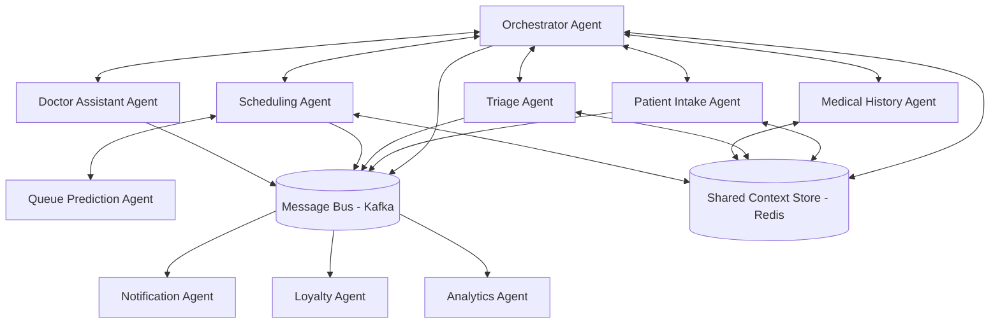

### 5.2 Two Communication Modes

| Mode | Used For | Mechanism |
|------|----------|-----------|
| **Synchronous (Request/Response)** | Real-time conversational flows where the patient is waiting (intake, triage, scheduling) | Direct agent-to-agent function calls orchestrated by the Orchestrator, sharing a request-scoped context object |
| **Asynchronous (Event-Driven)** | Background/downstream processes not in the patient's critical path (notifications, loyalty triggers, analytics logging) | Kafka topics — agents publish domain events; Notification, Loyalty, and Analytics agents subscribe |

### 5.3 Message Flow Example (Booking Confirmation)

```
1. Scheduling Agent confirms a slot
2. Scheduling Agent publishes event → topic: "appointment.booked"
   payload: {patient_id, doctor_id, slot_time, booking_ref}
3. Notification Agent (subscriber) consumes event → sends confirmation
4. Loyalty Agent (subscriber) consumes event → updates engagement score
5. Analytics Agent (subscriber) consumes event → logs KPI data point
```

This decouples the patient-facing response (which returns immediately once the slot is confirmed) from downstream side effects (notification, loyalty, analytics), keeping perceived latency low.

### 5.4 Event-Driven Architecture — Core Topics

| Topic | Publishers | Subscribers |
|-------|-----------|-------------|
| `patient.registered` | Patient Intake Agent | Loyalty, Analytics |
| `triage.assessed` | Triage Agent | Notification, Analytics, Orchestrator (escalation) |
| `appointment.booked` / `.cancelled` / `.rescheduled` | Scheduling Agent | Notification, Loyalty, Queue Prediction, Analytics |
| `note.finalized` | Doctor Assistant Agent | Medical History Agent (re-index), Analytics |
| `emergency.escalated` | Triage Agent / Orchestrator | Notification (human staff alert), Analytics |

### 5.5 Agent Memory

- **Per-session working memory** (short-term): held in the shared context store (Redis), scoped to the active conversation, expires after session end.
- **Persistent agent memory** (long-term): each agent that needs durable state (Medical History, Loyalty) reads/writes directly to its backing database rather than holding state in-process — agents themselves are largely **stateless and horizontally scalable**.

### 5.6 Shared Context Management

A `SessionContext` object is passed along the synchronous call chain, containing:

```json
{
  "session_id": "uuid",
  "patient_id": "uuid | null",
  "channel": "app | web | voice | whatsapp | call_center",
  "conversation_history": [...],
  "resolved_intent": "...",
  "priority": "CRITICAL | URGENT | STANDARD | null",
  "agent_trace": ["orchestrator", "triage", "scheduling"],
  "language_preference": "en | ar | ..."
}
```

This avoids each agent needing to re-fetch common context and gives the Orchestrator a full audit trail of which agents touched a given session.

### 5.7 Orchestrator Routing Logic (Simplified)

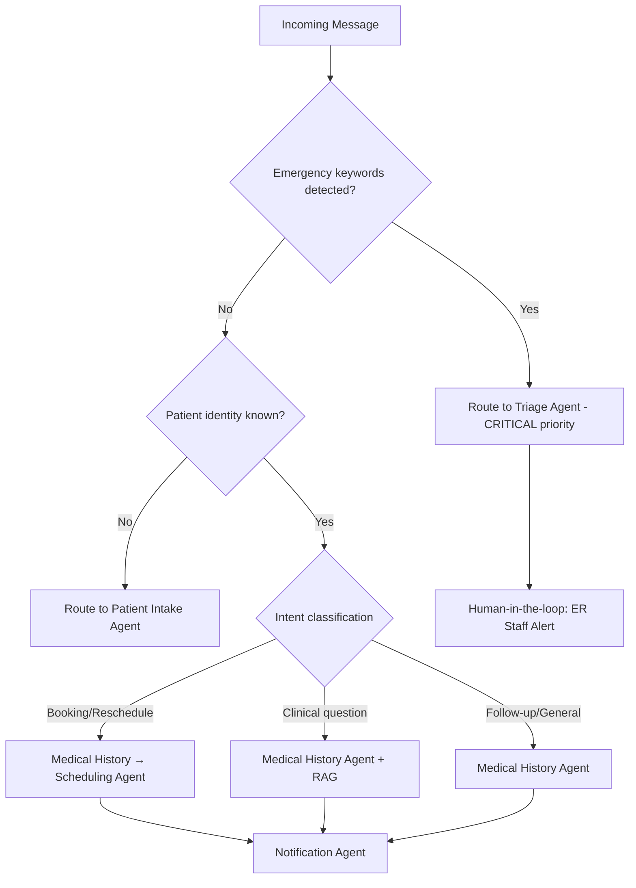

### 5.8 Human-in-the-Loop Escalation

Escalation to human staff occurs at clearly defined trigger points — this is a **safety design requirement**, not an optional feature:

| Trigger | Escalates To | SLA |
|---------|--------------|-----|
| Triage Agent returns CRITICAL | On-call ER staff | Immediate (<2 min) |
| Triage Agent confidence below threshold | Nurse/triage staff for manual review | <5 min |
| Doctor Assistant note pending approval | Attending doctor | Before note is committed to EHR |
| Patient explicitly requests a human | Call center / front desk | Next available agent |
| Repeated failed intent resolution (3+ turns) | Front desk staff | Immediate handoff with full transcript |

---

## 6. Knowledge Base Design

### 6.1 Overview

The knowledge layer separates **structured, transactional data** (best served by relational/document databases) from **unstructured, reference knowledge** (best served by a RAG/vector pipeline).

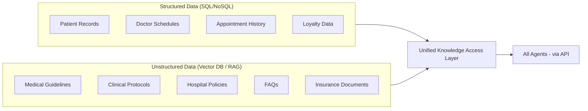

### 6.2 Structured Data Layer

| Data Type | Storage | Primary Consumers |
|-----------|---------|--------------------|
| Patient records (demographics, contact, insurance) | PostgreSQL | Patient Intake, Medical History, Scheduling |
| Doctor schedules & availability | PostgreSQL | Scheduling, Queue Prediction |
| Appointment history | PostgreSQL | Scheduling, Medical History, Analytics |
| Loyalty data (points, tiers, engagement) | MongoDB (flexible schema for evolving reward rules) | Loyalty Agent |
| Clinical structured fields (diagnoses codes, lab values, vitals) | PostgreSQL (EHR schema, e.g., FHIR-aligned tables) | Medical History, Doctor Assistant, Triage |

### 6.3 Unstructured Data Layer

| Data Type | Storage | Primary Consumers |
|-----------|---------|--------------------|
| Medical guidelines (e.g., clinical practice guidelines) | Vector DB (chunked + embedded) | Triage, Doctor Assistant |
| Clinical protocols (department-specific procedures) | Vector DB | Triage, Doctor Assistant |
| Hospital policies (admin, visiting hours, billing rules) | Vector DB | Orchestrator (general inquiries), Notification |
| FAQs (common patient questions) | Vector DB | Orchestrator, all patient-facing agents |
| Insurance documents (coverage rules, claim processes) | Vector DB | Patient Intake, Scheduling (coverage checks) |
| Clinical notes (free-text doctor notes, historical) | Vector DB, linked to EHR record | Medical History Agent |

### 6.4 How Each Agent Accesses the Knowledge Base

| Agent | Structured Access | Unstructured (RAG) Access |
|-------|--------------------|-----------------------------|
| Orchestrator | Patient lookup only | FAQs, hospital policies (general questions) |
| Patient Intake | Patient DB (write) | Insurance documents (coverage validation) |
| Triage | Medical History DB (allergies, conditions) | Medical guidelines, clinical protocols (risk scoring support) |
| Medical History | EHR DB (full read) | Clinical notes (semantic search across visit history) |
| Scheduling | Scheduling DB, Doctor Availability | Hospital policies (e.g., department-specific booking rules) |
| Queue Prediction | Operational/real-time DB | — (quantitative model, no RAG) |
| Notification | Patient DB (contact prefs) | FAQs (for auto-responding to simple queries) |
| Loyalty | Loyalty DB | — |
| Doctor Assistant | EHR DB (read/write with approval) | Medical guidelines, clinical protocols (terminology consistency) |
| Analytics | Analytics Warehouse | — |

---

## 7. RAG Architecture

### 7.1 Data Sources

- **EHR records** — de-identified clinical notes, discharge summaries
- **Hospital documents** — policies, department SOPs, visiting/admin rules
- **Medical protocols** — clinical practice guidelines, triage frameworks, treatment pathways
- **FAQs** — curated patient-facing Q&A content

### 7.2 RAG Pipeline

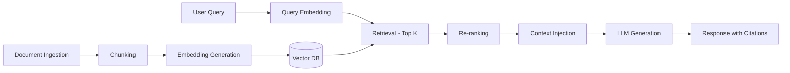

**Pipeline stages explained:**

1. **Document ingestion** — Source documents (PDFs, policy docs, structured guideline databases) are pulled via scheduled ETL jobs or event-triggered updates (e.g., a new clinical protocol published).
2. **Chunking** — Documents are split into semantically coherent chunks (typically 300–500 tokens with ~15% overlap), preserving section headers as metadata to maintain context.
3. **Embedding** — Each chunk is converted into a dense vector using an embedding model (e.g., `text-embedding-3-large` or a domain-tuned biomedical embedding model for clinical content).
4. **Retrieval** — At query time, the user/agent query is embedded and a top-K similarity search (typically K=10–20) is run against the vector DB, optionally filtered by metadata (document type, department, recency).
5. **Re-ranking** — A cross-encoder re-ranker refines the initial top-K down to the most relevant 3–5 chunks, improving precision over raw vector similarity alone — important in clinical contexts where near-miss retrievals can be misleading.
6. **Generation** — The re-ranked chunks are injected into the agent's prompt as grounding context, and the LLM generates a response that cites which source chunk(s) informed each claim.

### 7.3 Which Agents Use RAG and Why

| Agent | Uses RAG? | Why |
|-------|-----------|-----|
| Triage Agent | ✅ Yes | Grounds risk-scoring support in actual clinical protocol text, not just LLM parametric knowledge |
| Medical History Agent | ✅ Yes | Semantic search across a patient's free-text clinical notes to find relevant historical context |
| Doctor Assistant Agent | ✅ Yes | Ensures clinical note terminology and recommendations align with hospital-approved protocols |
| Orchestrator Agent | ✅ Yes (limited) | Answers general FAQs/policy questions without invoking a specialized agent |
| Scheduling Agent | ✅ Yes (limited) | Looks up department-specific scheduling rules/policies |
| Patient Intake Agent | ✅ Yes (limited) | Looks up insurance coverage documents during intake |
| Queue Prediction Agent | ❌ No | Purely quantitative/ML forecasting, no document grounding needed |
| Notification Agent | ❌ No (mostly) | Templated/personalized messaging, not knowledge retrieval |
| Loyalty Agent | ❌ No | Rules-based + structured data, no unstructured knowledge dependency |
| Analytics Agent | ❌ No | Operates on structured aggregated metrics |

### 7.4 Grounding & Safety Note

For all clinically-relevant RAG usage (Triage, Doctor Assistant), the system enforces a **citation requirement**: generated responses must reference the specific guideline/protocol chunk used, and any claim not traceable to a retrieved source is flagged for human review rather than presented as fact. This is critical in a healthcare context where unsupported LLM generation carries real patient-safety risk.

---
## 8. Vector Database Design

### 8.1 Comparison of Options

| Vector DB | Strengths | Weaknesses | Best Fit For |
|-----------|-----------|------------|---------------|
| **Pinecone** | Fully managed, excellent scaling, low ops overhead, strong metadata filtering | Cost scales with usage, vendor lock-in, data leaves your infra (compliance consideration) | Enterprise production at scale where ops simplicity outweighs cost |
| **Weaviate** | Open-source + managed option, built-in hybrid search (vector + keyword/BM25), GraphQL API | Slightly heavier to self-host, smaller ecosystem than Pinecone | Teams wanting hybrid search out-of-the-box with self-hosting flexibility |
| **Chroma** | Lightweight, simple to set up, great for prototyping, open-source | Less mature for high-scale production, fewer enterprise features | MVP / graduation project / hackathon — fast iteration |
| **Qdrant** | Open-source, strong filtering, good performance/cost ratio, can self-host or use cloud | Smaller community than Pinecone/Weaviate | Cost-sensitive production deployments needing strong metadata filtering |
| **Milvus** | Highly scalable, mature for very large datasets, strong open-source community | More complex to operate (requires more infra expertise) | Large-scale enterprise deployments with massive document volumes |

### 8.2 Recommendation

**For this project: Chroma for MVP/development → Qdrant for production.**

**Reasoning:**
- **Chroma** has near-zero setup overhead, runs embedded or as a lightweight service, and is ideal for a graduation project / hackathon timeline where iteration speed matters more than scale.
- **Qdrant** is the recommended production target because it is open-source (avoiding vendor lock-in important for healthcare data sovereignty/compliance), self-hostable within a HIPAA-compliant environment, has strong metadata filtering (essential for scoping retrieval by document type, department, or patient consent status), and offers a better cost-to-performance ratio than Pinecone at moderate scale.
- **Pinecone** remains a strong alternative if the team prioritizes zero-ops managed infrastructure and the budget supports it — but self-hosting (Qdrant/Weaviate) gives more control over where sensitive healthcare-adjacent embeddings are stored, which matters for compliance.

### 8.3 Collections Design

Separate collections (not one mega-collection) are used to allow independent access control, embedding model choice, and retrieval tuning per content type:

| Collection | Content | Embedding Model | Access Scope |
|------------|---------|------------------|---------------|
| `clinical_protocols` | Medical guidelines, treatment pathways | Domain-tuned biomedical embedding model | Triage, Doctor Assistant |
| `hospital_policies` | Admin policies, visiting hours, billing rules | General-purpose embedding model | Orchestrator, Scheduling |
| `faqs` | Curated patient Q&A | General-purpose embedding model | Orchestrator, Notification |
| `insurance_docs` | Coverage rules, claims processes | General-purpose embedding model | Patient Intake, Scheduling |
| `clinical_notes_{patient_id}` *or* `clinical_notes` (partitioned by patient_id metadata) | De-identified free-text clinical notes | Domain-tuned biomedical embedding model | Medical History Agent only (strict access control) |

> **Design choice:** `clinical_notes` uses a **single collection with `patient_id` as a mandatory metadata filter** (rather than one collection per patient) to keep the index manageable while enforcing strict query-time isolation — every retrieval call must include the requesting patient's ID as a hard filter, never a soft preference.

### 8.4 Metadata Schema (Example)

```json
{
  "chunk_id": "uuid",
  "source_document_id": "uuid",
  "collection": "clinical_protocols",
  "document_type": "guideline | policy | faq | clinical_note | insurance",
  "department": "cardiology | emergency | general | ...",
  "patient_id": "uuid | null",
  "language": "en | ar",
  "created_at": "ISO-8601 timestamp",
  "last_reviewed_at": "ISO-8601 timestamp",
  "source_title": "string",
  "chunk_index": "integer",
  "sensitivity_level": "public | internal | phi"
}
```

### 8.5 Search Strategy

- **Hybrid search** (dense vector + sparse/BM25 keyword) is used for FAQs and policies, where exact term matching (e.g., a specific policy number or drug name) matters alongside semantic similarity.
- **Pure dense retrieval** is used for clinical protocol and clinical note search, where conceptual similarity matters more than exact phrasing.
- **Mandatory metadata pre-filtering** (e.g., `patient_id`, `sensitivity_level`) is applied **before** similarity search runs, never as a post-filter — this is both a performance optimization and a hard access-control boundary, ensuring a retrieval query can never surface another patient's data even via similarity ranking.
- **Re-ranking** (cross-encoder) is applied to the top-K dense results before final context injection (see Section 7.2).

---

## 9. AI Framework & Technology Stack

### 9.1 Agent Framework

| Framework | Strengths | Weaknesses |
|-----------|-----------|------------|
| **LangGraph** | Explicit state machine/graph model — ideal for the deterministic, auditable routing this system needs (e.g., emergency escalation paths); strong support for human-in-the-loop checkpoints; good observability | Steeper learning curve than simpler agent loops |
| **CrewAI** | Simple role-based agent definition, fast to prototype multi-agent collaboration | Less fine-grained control over execution graphs; less mature for safety-critical branching logic |
| **AutoGen** | Strong for conversational multi-agent patterns, good research backing | More oriented toward open-ended agent conversation than deterministic business workflows |
| **OpenAI Agents SDK** | Clean tool-calling abstraction, good if standardizing on OpenAI models | Tighter coupling to OpenAI ecosystem; less flexible for the rules-engine-heavy logic this system needs (e.g., triage scoring) |

**Recommendation: LangGraph.** The explicit graph/state-machine model maps directly onto this system's needs: deterministic routing (Orchestrator), mandatory human-in-the-loop checkpoints (Triage escalation, Doctor Assistant note approval), and full auditability of agent execution paths — all of which are harder to guarantee in more free-form agent-conversation frameworks. LangGraph also integrates cleanly with LangChain's RAG tooling, reducing integration overhead for Section 7's pipeline.

### 9.2 LLMs

| Model | Strengths | Weaknesses | Recommended Use |
|-------|-----------|------------|-------------------|
| **GPT-4o** | Strong general reasoning, multimodal, fast | Cost at scale, data residency considerations for healthcare data | Doctor Assistant note drafting, complex reasoning tasks |
| **Claude** | Strong instruction-following, large context window (good for long clinical histories), strong safety alignment | — | Triage Agent (safety-critical reasoning), Medical History summarization |
| **Gemini** | Strong multimodal, competitive pricing, good integration with Google Cloud healthcare APIs | Less mature healthcare-specific tooling ecosystem currently | Alternative for cost-sensitive multimodal tasks (e.g., voice channel) |
| **Open-source (Llama, Mistral, biomedical-tuned variants)** | Full data control (self-hosted = strong compliance posture), no per-token cost at scale, can fine-tune on clinical data | Requires significant MLOps investment; generally lower out-of-box reasoning quality than frontier closed models | Long-term cost optimization once volume justifies self-hosting; good fit for narrow, well-defined tasks like Notification Agent templating |

**Recommendation:** A **multi-model strategy** — Claude for safety-critical reasoning (Triage, Medical History summarization) given its strong instruction-following and large context window for clinical histories; GPT-4o for Doctor Assistant note generation given strong structured-output reliability; an open-source model for low-stakes, high-volume tasks (Notification message templating) to control cost. All clinical-context calls should route through a model accessed via a HIPAA-compliant API agreement (e.g., Business Associate Agreement in place with the provider).

### 9.3 Backend

| Option | Recommendation |
|--------|-----------------|
| **FastAPI** | ✅ Recommended — async-native (critical for orchestrating multiple concurrent agent calls), excellent typing/validation via Pydantic (important for structured agent I/O), strong Python ecosystem alignment with LangGraph/ML tooling |
| Node.js | Viable alternative if team has stronger JS expertise, but loses tight integration with the Python-centric AI/ML tooling ecosystem |

### 9.4 Frontend

| Option | Recommendation |
|--------|-----------------|
| **Next.js** | ✅ Recommended for the web portal — SSR for fast initial load, good SEO for the public-facing site, strong ecosystem for building the admin analytics dashboard |
| React | Used within Next.js; standalone React acceptable for the mobile-web or embedded widget use case |

### 9.5 Databases

| Database | Use Case | Justification |
|----------|----------|-----------------|
| **PostgreSQL** | Patient records, scheduling, EHR structured fields | ACID compliance critical for clinical/scheduling data integrity; strong support for structured healthcare schemas (FHIR-aligned tables); mature row-level security for compliance |
| **MongoDB** | Loyalty data, flexible/evolving schemas (notification templates, agent configuration) | Schema flexibility suits rapidly-evolving loyalty rules and configuration data that doesn't need relational integrity |

### 9.6 Messaging

| Option | Recommendation |
|--------|-----------------|
| **Kafka** | ✅ Recommended for production — durable event log, replay capability (important for audit/compliance), scales to high-throughput event streams (queue events, notifications) |
| RabbitMQ | Acceptable lighter-weight alternative for MVP if Kafka's operational overhead isn't justified yet |

### 9.7 Cache

**Redis** — used for session/shared-context storage (Section 5.6), real-time queue state (feeding the Queue Prediction Agent), and general API response caching to reduce redundant LLM/DB calls.

### 9.8 Deployment

| Component | Recommendation | Justification |
|-----------|-----------------|-----------------|
| **Docker** | ✅ All services containerized | Consistent dev/prod environments, required foundation for Kubernetes |
| **Kubernetes** | ✅ Production orchestration | Independent scaling per agent (e.g., Triage Agent may need different scaling than Analytics), rolling deployments, self-healing |
| **Azure or AWS** | Either viable; **Azure** has a slight edge for healthcare given Azure Health Data Services (FHIR-native APIs, built-in compliance tooling) | Both offer HIPAA-eligible services; choice often driven by existing institutional cloud relationships |

---

## 10. Memory Architecture

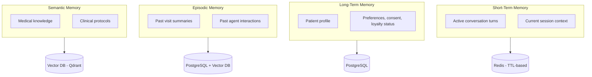

| Memory Type | Definition | Storage | TTL / Lifecycle |
|-------------|------------|---------|-------------------|
| **Short-Term Memory** | Conversation memory within an active session — current dialogue turns, in-progress intent resolution | Redis | Expires at session end (e.g., 30 min inactivity timeout) |
| **Long-Term Memory** | Durable patient profile — demographics, preferences, consent records, loyalty tier | PostgreSQL | Persistent, retained per data-retention policy |
| **Episodic Memory** | Record of previous interactions and visits — "what happened last time" | PostgreSQL (structured visit records) + Vector DB (semantic search over visit summaries) | Persistent, with archival tiering for older records |
| **Semantic Memory** | General medical knowledge — guidelines, protocols, drug interactions | Vector DB (Qdrant), refreshed via scheduled re-ingestion as protocols update | Persistent, versioned (old protocol versions retained for audit) |

**Key design principle:** Short-term memory is intentionally **ephemeral and stateless at the agent level** — agents don't hold conversation state in-process — while long-term/episodic/semantic memory are **centralized in durable stores** so any agent instance (in a horizontally-scaled deployment) can pick up a session with full context.

---
## 11. Security & Compliance

### 11.1 HIPAA Compliance

- **Business Associate Agreements (BAAs)** must be in place with every third-party service touching PHI (LLM API providers, cloud hosting, messaging APIs like WhatsApp Business/Twilio).
- **Minimum necessary access**: each agent's database/vector-store access is scoped to only the fields/collections it needs (e.g., the Notification Agent never reads raw clinical notes, only delivery-relevant contact preferences and pre-approved message content).
- **De-identification** of clinical notes before vector embedding where feasible, with re-identification only at the final retrieval step via secure, access-controlled joins.
- **Audit logging** of every access to PHI — who/what (including which agent) accessed which record, when, and why (linked to the triggering session).

### 11.2 GDPR Considerations

- **Right to access / right to erasure**: patient data architecture must support full export and deletion, including associated vector embeddings (requires tracking which vector chunks derive from which patient's data).
- **Data minimization**: only collect fields actually needed for care delivery and operations — avoid speculative data collection "in case it's useful."
- **Explicit consent capture** at intake (Patient Intake Agent), versioned and timestamped, with the ability for patients to withdraw consent for specific data uses (e.g., consent to AI-assisted note drafting vs. core care delivery).
- **Data residency**: where applicable, ensure data storage/processing location complies with regional requirements (relevant if deploying across EU and non-EU regions).

### 11.3 Authentication

- **Patients**: multi-factor authentication for the patient portal/app (password + OTP); passwordless magic-link option for lower-friction channels (WhatsApp/SMS-verified sessions).
- **Staff (doctors, nurses, admins)**: enterprise SSO (SAML/OIDC) integrated with hospital identity provider, with mandatory MFA.
- **Service-to-service**: mutual TLS (mTLS) and short-lived service tokens (OAuth2 client credentials flow) between agents and backend services — no long-lived static API keys in production.

### 11.4 Authorization

- **Role-Based Access Control (RBAC)** at minimum, with **Attribute-Based Access Control (ABAC)** for finer-grained clinical data rules (e.g., a doctor can access full history only for patients under their active care).
- Agent-level authorization: each agent operates under a scoped service identity with explicit permission grants per database/collection (principle of least privilege), enforced at the API gateway layer, not just application logic.

### 11.5 Encryption

- **At rest**: AES-256 encryption for all databases (PostgreSQL TDE, MongoDB encrypted storage engine, vector DB encrypted volumes).
- **In transit**: TLS 1.2+ enforced for all API traffic, including internal service-to-service calls.
- **Field-level encryption** for the most sensitive fields (national ID numbers, insurance numbers) as an additional layer beyond disk-level encryption.

### 11.6 Audit Logs

- Immutable, append-only audit log (write-once storage or cryptographically chained log entries) capturing: actor (user or agent), action, resource accessed, timestamp, session ID, and outcome.
- Specifically required for: every PHI read/write, every triage escalation decision, every clinical note finalization, and every authentication event (success and failure).
- Retention period aligned with applicable regulation (commonly 6+ years for HIPAA-covered entities) and stored separately from operational databases to prevent tampering.

### 11.7 Data Privacy — Additional Safeguards

- **PHI scoping in LLM prompts**: prompts sent to LLM providers should include only the minimum PHI necessary for the task, with non-essential identifiers stripped or tokenized where possible.
- **No PHI in logs/observability tooling** by default — application logs and tracing systems must redact or exclude clinical content, logging only non-PHI metadata (agent name, latency, status).
- **Vendor risk assessment** for every external API/tool integrated into the agent stack, with PHI exposure explicitly documented per vendor.

---

## 12. Comparison Table — All Agents at a Glance

| Agent | Inputs | Processing | Tools | Outputs | Databases |
|-------|--------|------------|-------|---------|-----------|
| **Orchestrator** | Patient message, session history, channel metadata | Intent classification, routing, escalation detection | LLM, rules engine, context store | Routed task(s), unified response, escalation events | Session Store (Redis), Patient DB, Audit Log |
| **Patient Intake** | Conversational demographic/insurance responses | Conversational field collection, validation, dedup detection | LLM, validation utilities, fuzzy-match ML | Structured patient profile, `patient_id`, consent record | Patient DB, Consent/Audit Log |
| **Triage** | Reported symptoms, known conditions, onset/duration | Symptom extraction, red-flag detection, risk scoring | LLM, clinical rules engine, classification ML | Risk tier, symptom summary, escalation flag | Medical History DB, Clinical Protocols KB (RAG), Audit Log |
| **Medical History** | `patient_id`, query context | Cross-branch aggregation, semantic retrieval, summarization | LLM, RAG/Vector Search, SQL | History summary, clinical flags, relevant context | EHR DB, Vector DB, Patient DB |
| **Scheduling** | Booking request, doctor availability, queue predictions | Constraint-based slot search, continuity weighting, conflict resolution | LLM, optimization logic, calendar APIs | Confirmed/proposed slot, calendar entry, booking ref | Scheduling DB, Doctor Availability DB, Patient DB |
| **Queue Prediction** | Queue state, historical durations, real-time events | Time-series forecasting, drift detection | ML forecasting model, stream processing | Predicted wait time, queue status updates | Operational DB, Analytics Warehouse |
| **Notification** | Event trigger, channel preferences | Channel selection, timing optimization, personalization | LLM, messaging APIs | Sent notification, delivery status | Patient DB, Notification Log DB |
| **Loyalty** | Visit history, engagement history, loyalty rules | Lapsed-patient detection, segmentation, points calculation | LLM, rules engine, analytics queries | Loyalty status updates, re-engagement triggers | Loyalty DB, Patient DB, Analytics Warehouse |
| **Doctor Assistant** | `patient_id`, dictated/typed notes, pre-visit history | Brief generation, note structuring (SOAP), action extraction | LLM, speech-to-text, RAG | Draft clinical note, action items, pre-visit brief | EHR DB, Clinical Protocols KB, Scheduling DB |
| **Analytics & Optimization** | Aggregated event logs from all agents | KPI computation, anomaly detection, insight generation | LLM, BI engine, ML anomaly detection | KPI dashboards, narrative insights, recommendations | Analytics Warehouse, Audit Log DB |

---

## 13. Full Project Structure

```
healthcare-agentic-system/
│
├── frontend/                      # Next.js patient portal + admin dashboard
│   ├── app/
│   │   ├── patient/                # Patient-facing booking/chat UI
│   │   ├── doctor/                 # Doctor Assistant workstation UI
│   │   └── admin/                  # Analytics & KPI dashboards
│   ├── components/
│   └── lib/
│
├── backend/                       # FastAPI application layer
│   ├── api/                        # REST/WebSocket endpoints per domain
│   │   ├── patients/
│   │   ├── appointments/
│   │   └── notifications/
│   ├── core/                       # Auth, config, middleware
│   └── gateway/                    # API gateway / agent invocation layer
│
├── agents/                        # All agent implementations (LangGraph)
│   ├── orchestrator/
│   │   ├── graph.py                 # LangGraph state machine definition
│   │   ├── router.py                # Intent classification & routing logic
│   │   └── prompts/
│   ├── intake/
│   ├── triage/
│   │   ├── scoring_engine.py        # Deterministic clinical scoring logic
│   │   └── prompts/
│   ├── medical_history/
│   ├── scheduling/
│   ├── queue_prediction/
│   │   └── forecasting_model.py     # Time-series ML model
│   ├── notification/
│   ├── loyalty/
│   ├── doctor_assistant/
│   └── analytics/
│
├── rag/                            # RAG pipeline components
│   ├── ingestion/                   # Document loaders, chunking logic
│   ├── embedding/                   # Embedding model wrappers
│   ├── retrieval/                   # Retrieval + re-ranking logic
│   └── pipelines/                   # End-to-end pipeline orchestration per use case
│
├── vector_db/                      # Vector DB client + collection management
│   ├── client.py
│   ├── collections/                 # Per-collection schema/config (clinical_protocols, faqs, etc.)
│   └── migrations/
│
├── workflows/                      # Cross-agent business workflows (event-driven)
│   ├── booking_workflow.py
│   ├── emergency_escalation_workflow.py
│   └── consultation_workflow.py
│
├── tools/                          # Shared tool implementations agents call
│   ├── calendar_api.py
│   ├── messaging_api.py             # WhatsApp/SMS/Push integrations
│   └── validation_utils.py
│
├── memory/                         # Memory layer implementations
│   ├── short_term.py                 # Redis-backed session context
│   ├── long_term.py                  # Patient profile persistence
│   ├── episodic.py                   # Visit history retrieval
│   └── semantic.py                   # Vector-backed knowledge memory
│
├── prompts/                        # Centralized prompt templates & versioning
│   ├── orchestrator/
│   ├── triage/
│   └── doctor_assistant/
│
├── APIs/                           # External API integration clients
│   ├── llm_providers/                # Claude, GPT-4o, Gemini client wrappers
│   ├── ehr_integration/              # FHIR/HL7 integration adapters
│   └── insurance_providers/
│
├── tests/                          # Unit, integration, and agent-eval tests
│   ├── unit/
│   ├── integration/
│   └── agent_evals/                  # Scenario-based agent behavior tests (incl. triage safety tests)
│
├── monitoring/                     # Observability stack config
│   ├── dashboards/                   # Grafana/equivalent dashboard definitions
│   ├── alerts/                       # Alert rules (latency, escalation failures, etc.)
│   └── logging_config/
│
├── deployment/                     # Infra-as-code & deployment configs
│   ├── docker/                       # Dockerfiles per service
│   ├── kubernetes/                   # K8s manifests/Helm charts
│   └── terraform/                    # Cloud infra provisioning (Azure/AWS)
│
└── docs/                           # Architecture docs, runbooks, compliance docs
    ├── architecture/
    ├── compliance/                   # HIPAA/GDPR documentation
    └── runbooks/                     # Incident response procedures
```

### 13.1 Folder Purpose Summary

| Folder | Purpose |
|--------|---------|
| `frontend/` | All user-facing interfaces — patient app/web, doctor workstation, admin dashboards |
| `backend/` | FastAPI service layer handling HTTP/WebSocket requests and routing to the agent layer |
| `agents/` | Core agent logic — one subfolder per specialized agent, each with its graph/state logic and prompts |
| `rag/` | The complete retrieval-augmented generation pipeline, decoupled from individual agents for reuse |
| `vector_db/` | Vector database client configuration, collection schemas, and migration scripts |
| `workflows/` | Multi-agent orchestrated business processes that span more than one agent (e.g., the full emergency escalation path) |
| `tools/` | Reusable tool functions agents invoke (calendar access, messaging, validation) — kept separate from agent logic for testability |
| `memory/` | Implementation of the four memory types described in Section 10 |
| `prompts/` | Version-controlled prompt templates, separated from code for easier iteration/review by non-engineers |
| `APIs/` | Clients for external systems — LLM providers, hospital EHR/FHIR systems, insurance providers |
| `tests/` | All testing layers, notably `agent_evals/` for scenario-based safety testing of high-stakes agents like Triage |
| `monitoring/` | Observability — dashboards, alerting rules, structured logging configuration |
| `deployment/` | Containerization and infrastructure-as-code for reproducible deployments |
| `docs/` | Architecture documentation, compliance evidence, and operational runbooks |

---

## 14. MVP vs Enterprise Version

### 14.1 MVP (Graduation Project / Hackathon Scope — 1 to 3 Months)

**Goal:** Demonstrate the core agentic workflow end-to-end with a focused, defensible scope.

| Component | MVP Scope |
|-----------|-----------|
| **Agents** | Orchestrator, Patient Intake, Triage, Medical History, Scheduling, Notification (6 core agents) — Queue Prediction, Loyalty, Doctor Assistant, Analytics can be simplified or stubbed |
| **Channels** | Web app + one messaging channel (e.g., WhatsApp or a chat widget) — skip voice assistant and call center integration |
| **Triage logic** | Rules-based scoring with LLM-assisted symptom extraction; clearly documented as a prototype, not clinically validated |
| **RAG** | Single Vector DB (Chroma) with one or two knowledge collections (FAQs + one clinical protocol set) |
| **Databases** | PostgreSQL for structured data; skip MongoDB/Kafka — use simple async task queue instead |
| **Frontend** | Patient booking flow + simple admin view of bookings; skip full analytics dashboard |
| **Security** | Authentication, encryption in transit/at rest, basic audit logging — full HIPAA certification process out of scope, but architecture should be HIPAA-ready |
| **Deployment** | Docker Compose locally or single-cloud-instance deployment; Kubernetes not required |
| **Demonstration focus** | Full Scenario 1 (new patient) and Scenario 3 (emergency) end-to-end, since these best showcase the agentic + safety-critical design |

### 14.2 Enterprise Version (Real-World Deployment)

**Goal:** Production-grade, compliant, scalable system for actual hospital operations.

| Component | Enterprise Additions |
|-----------|------------------------|
| **Agents** | All 10 agents fully implemented, including ML-driven Queue Prediction and full Analytics & Optimization with predictive recommendations |
| **Channels** | Full omnichannel: app, web, voice assistant (IVR), WhatsApp, and AI-assisted call center copilot |
| **Triage logic** | Clinically validated scoring model, reviewed/approved by medical professionals, with continuous outcome-based recalibration |
| **RAG** | Production vector DB (Qdrant), multiple specialized collections, hybrid search, scheduled re-ingestion pipelines for protocol updates |
| **Databases** | Full PostgreSQL + MongoDB split, Kafka event bus, Redis caching layer at scale |
| **Integration** | Native EHR/HIS integration via FHIR/HL7 standards, insurance provider APIs, lab system integrations |
| **Frontend** | Full patient portal, doctor workstation with voice dictation, comprehensive admin analytics suite with drill-down dashboards |
| **Security & Compliance** | Full HIPAA/GDPR compliance program, signed BAAs with all vendors, formal audit logging with immutable storage, regular penetration testing, SOC 2 readiness |
| **Deployment** | Multi-region Kubernetes deployment, auto-scaling per agent, disaster recovery/business continuity plan, blue-green deployments |
| **Governance** | Clinical advisory board sign-off on Triage and Doctor Assistant agent behavior, formal model monitoring for drift, human-in-the-loop audit sampling |
| **Multi-tenancy** | Support for multiple hospital branches/networks with data isolation per tenant |

---
## 15. Final System Diagrams

### 15.1 High-Level Architecture Diagram

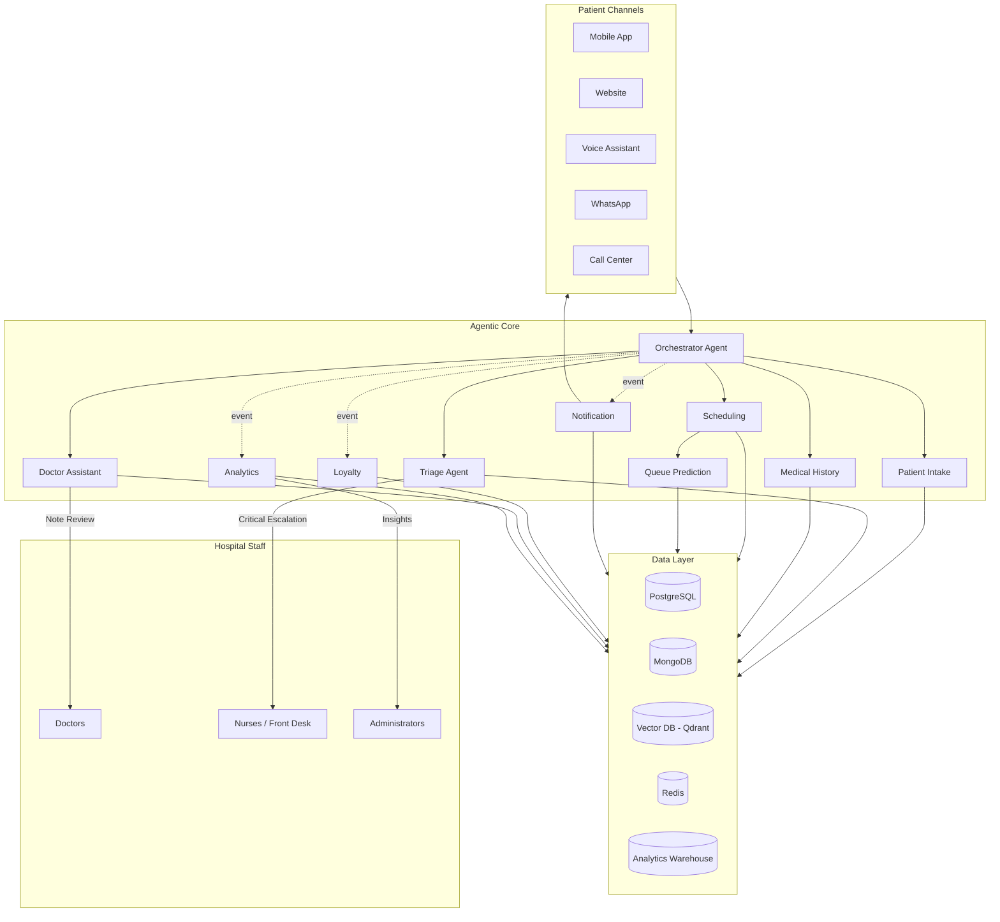

### 15.2 Agent Communication Diagram

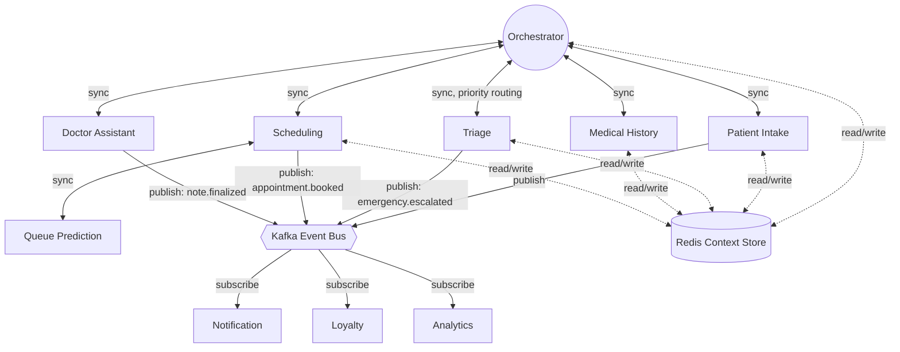

### 15.3 RAG Architecture Diagram

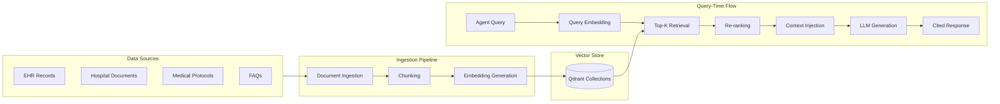

### 15.4 Data Flow Diagram

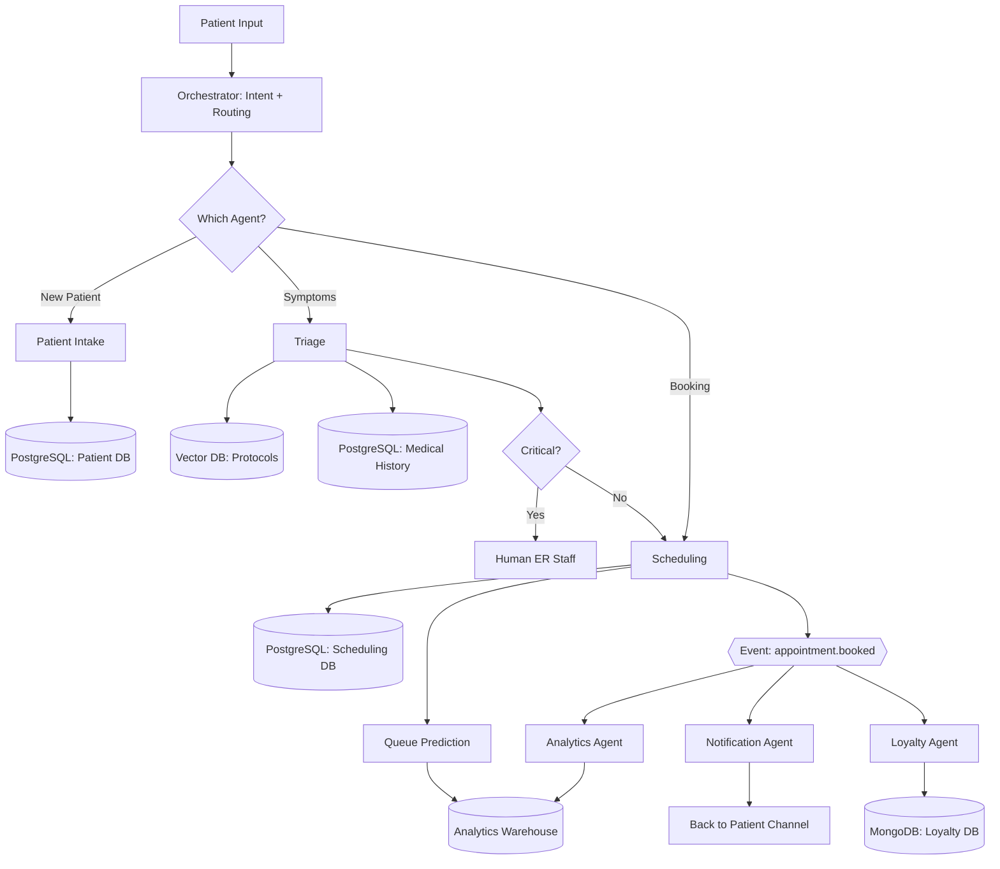

### 15.5 Deployment Architecture Diagram

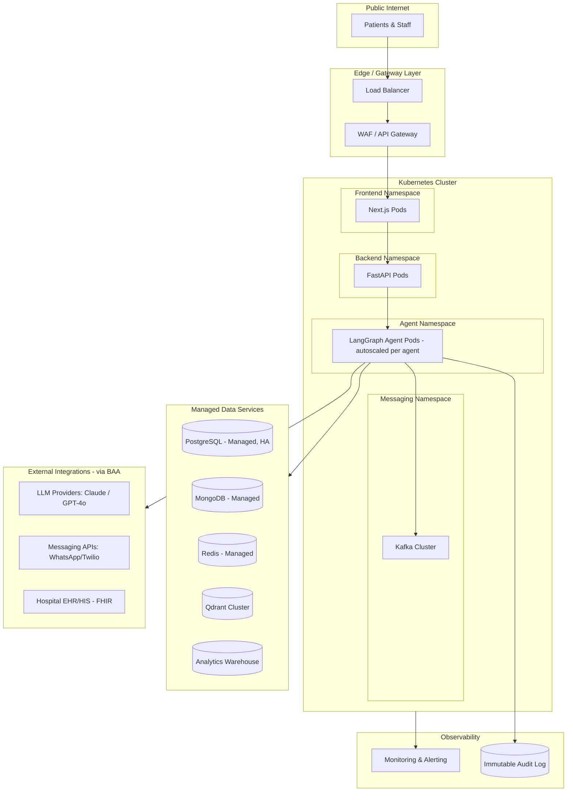

---

## Summary

This architecture delivers an end-to-end agentic AI healthcare patient management system that directly addresses long wait times, scheduling inefficiency, fragmented records, weak patient engagement, and limited operational visibility — through ten specialized, well-governed agents coordinated by a central Orchestrator, grounded by a RAG-powered knowledge layer, and built on a stack (LangGraph, FastAPI, Next.js, PostgreSQL/MongoDB, Qdrant, Kafka, Kubernetes) chosen specifically for the auditability, compliance, and safety guarantees that healthcare applications demand. The MVP/Enterprise split (Section 14) gives a clear, realistic path from a graduation-project-scoped demo to a production-grade deployment.

**A note on scope for presentation:** The Triage Agent and Doctor Assistant Agent are the system's safety-critical components — any demo or pitch should be explicit that their outputs are decision-support and drafts requiring human (clinical) review, not autonomous diagnosis or treatment. This framing is both clinically responsible and typically strengthens credibility with healthcare stakeholders and technical judges alike.
